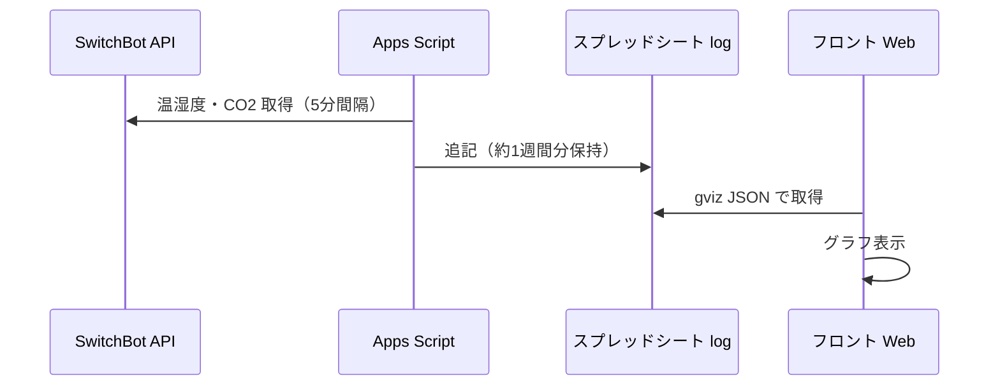

# switchbot-logger

[SwitchBot CO2センサー（温湿度計）](https://www.switchbot.jp/products/switchbot-co2-meter) のデータを Google スプレッドシート経由で取得し、Web でグラフ表示するアプリです。部屋の温度・湿度・不快指数・CO2 を折れ線グラフで確認できます。

## アーキテクチャ



- Apps Script が 5 分間隔で SwitchBot API から温湿度・CO2 を取得し、スプレッドシートの `log` シートに追記する（約 1 週間分を保持）。
- フロントはそのシートを gviz（JSON）で取得し、React でグラフを表示する。

## 主な機能

- **折れ線グラフ**: 温度・湿度・不快指数・CO2 の 4 種類を表示
- **表示範囲**: 1 時間 / 12 時間 / 1 日 / 1 週間で切り替え可能

## 技術スタック

- React 18, Recharts, Vite, TypeScript

## ローカルで動かす

```bash
pnpm install
pnpm dev
```

## ビルド・デプロイ

```bash
pnpm build
```

- `main` ブランチへ push すると、GitHub Actions でビルドされ GitHub Pages に自動デプロイされます。

## データの記録（GAS）

スプレッドシートへの記録は Google Apps Script で行います。設定・トリガー・シート形式などは [apps_script/README.md](apps_script/README.md) を参照してください。
